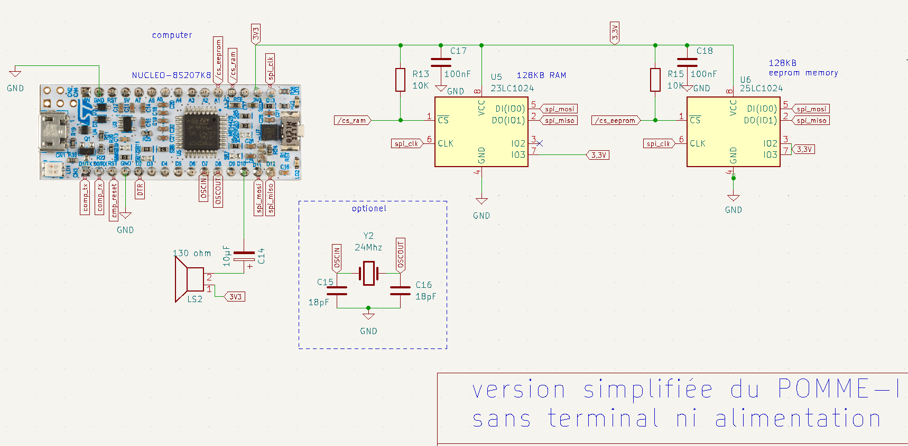
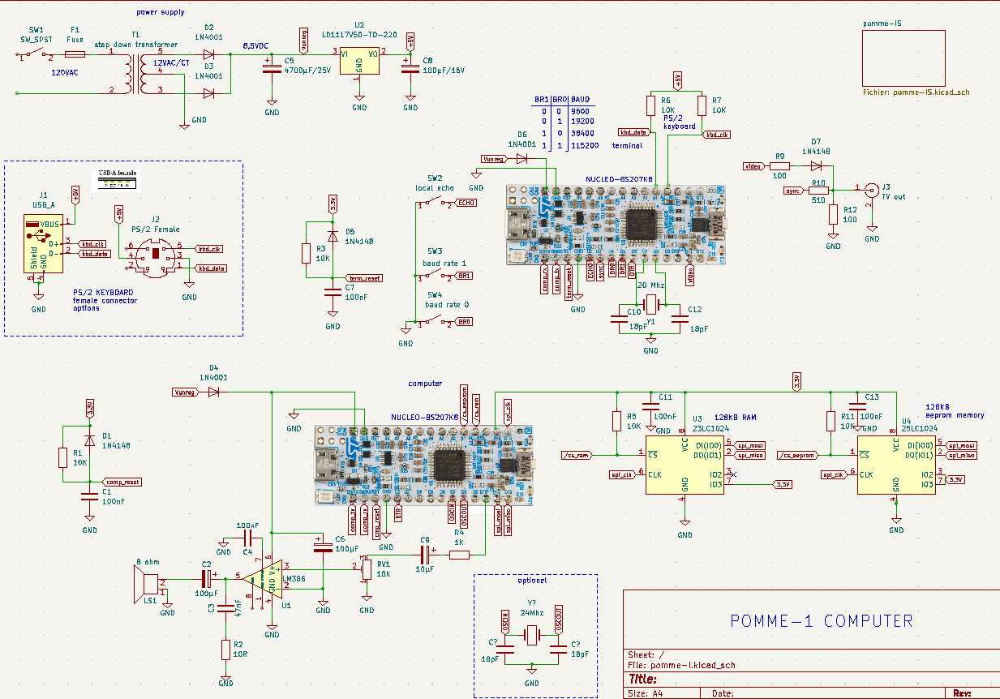

<!--
;;
; Copyright Jacques Deschênes 2023,2024  
; This file is part of pomme-I 
;
;     pomme-I is free software: you can redistribute it and/or modify
;     it under the terms of the GNU General Public License as published by
;     the Free Software Foundation, either version 3 of the License, or
;     (at your option) any later version.
;
;     pomme-I is distributed in the hope that it will be useful,
;     but WITHOUT ANY WARRANTY; without even the implied warranty of
;     MERCHANTABILITY or FITNESS FOR A PARTICULAR PURPOSE.  See the
;     GNU General Public License for more details.
;
;     You should have received a copy of the GNU General Public License
;     along with pomme-I.  If not, see <http://www.gnu.org/licenses/>.
;;
-->
# Projet pomme-I  montage du circuit 

## circuit minimum

### liste du matériel requis 

1. 1 Carte **NUCLEO-8S207K8**
1. 1 EEPROM SPI **23LC1024** de 128KO pour sauvegarde des fichiers.
1. 1 RAM SPI **25LC1024** de 128KO pour augmenter la mémoire RAM.
1. 2 résistances de **10Ko 1/4 watt**. 
1. 2 Condenstateur céramique de **100nF** 
1. 1 Petit haut-parleur piézo ou électromagnétique de 130 ohm.
1. 1 condensateur électrochimique de **10µF/16Volt**.
1. 1 Cable USB avec connecteur A et micro C pour connecter la carte à l'ordinateur .

### Option 

Il est possible d'ajouter un cristal de 24Mhz au circuit comme indiqué dans l'encadré pour un gain de vitesse de 50%. Si cette option est choisie il faut 
modifier la variable **HSI** dans le fichier [config.inc](config.inc) pour la mettre à zéro. 

Composants supplémentaires:

1. 1 **crystal 24Mhz**  P/N HC49US-FF3F18-24.000MHZ  ou équivalent.
1. 2 condensateurs céramique **18pF NP0**.

## Montage 

Le montage peut-être effectué sur une plaque sans soudure comme ceci:

**NOTE:** Les plus observateurs remarquerons que je n'ai pas installé le condensateur de 10µF entre le haut-parleur et la sortie **D10** de la carte **NUCLEO**. Dans ce cas il y a un risque d'endommager le µC si la sortie demeure à zéro volt sauf si vous utilisez un haut-parleur piézo.  

Pour un montage permanent sur une plaque comme celle-ci:

## Programmation

Lorsqu'on branche la carte **NUCLEO-8S207K8** à l'ordinateur un nouveau lecteur apparaît, Vous allez le reconnaître par son nom. Il suffit de copier le fichier [pomme_1.bin](build/stm8s207k8/pomme_1.bin) sur ce lecteur. 

## Utilisation 

Ce circuit est utilisé en le branchant simplement à un PC. Le programmeur ST-LINK V2 inclus sur la carte NUCLEO créé un lecteur de disque virtuel ainsi qu'un port sériel.  Il suffit d'utilisé un émulateur de terminal configuré à 115200 BAUD 8N1 pour communiquer avec le **pomme-I**. Cependant dans cette configuration minimale la commande **p1BASIC** **CHAT** qui rapporte le caractère à une certaine position sur le terminal ne fonctionne pas. Cette fonction ne fonctionne qu'avec le terminal [STM8-TERMINAL](https://github.com/picatout/stm8_terminal.git)

## Montage complet

Sur une carte pleine longueur (60 colonnnes) il est possible d'assembler l'ordinateur et le terminal [STM8-TERMINAL](https://github.com/picatout/stm8_terminal.git).

 

Le circuit complet comprend une alimentation de 5VDC ainsi que le terminal STM8, ainsi qu'un ampli audion **LM386**. 

## Composants supplémentaire

### Pour l'alimentation 

1. 1 transformateur 120VAC/12VAC 500ma avec *center tap*. Pour l'Europe c'est 220VAC/12VAC. 
1. 2 diodes **1N4001**. 
1. 1 condensateur électrochimique de **4700µF/25Volt**.
1. 1 condensateur électrochimique de **100µF/16Volt**.
1. 1 régulateur de tension **LD1117V5.0 boitier **TO-220**.
1. 1 commutateur d'alimentation pour le 120VAC.

### Pour le terminal STM8

1. 1 carte **NUCLEO-8S207K8**. 
1. 1 crystal **20Mhz 18pF** 
1. 2 condensateur céramique **18pF NP0**.
1. 1 connecteur **mini-DIN-6** ou **USB-A femelle** pour brancher un clavier **PS2**.
1. 1 Clavier compatible avec l'interface **PS2**. Certain clavier avec un connecteur USB-A le sont. Surtout les anciens. J'ai utilisé un [mcSaite](https://www.amazon.ca/Keyboard-Portable-Professional-Industrial-Computer/dp/B07DZZWD9W/ref=asc_df_B07DZZWD9W/?tag=googleshopc0c-20&linkCode=df0&hvadid=660432358477&hvpos=&hvnetw=g&hvrand=1328198157581809111&hvpone=&hvptwo=&hvqmt=&hvdev=c&hvdvcmdl=&hvlocint=&hvlocphy=9000300&hvtargid=pla-796210651866&psc=1&mcid=9a75536e97f23ebb934535448bfbc6f1) acheté sur Amazon.ca.
1. 2 diodes **1N4148**. 
1. 4 résistances **10Ko 1/4Watt**.
1. 4 condensateurs céramique **100nF** pour le filtrage des alimentations.
1. 1 ampli audio **LM386**.
1. 1 condensateur électrochimique **100µF/16Volt**.  
1. 1 condensateur électrochimique **10µF/16Volt**.
1. 1 résistance **1Ko 1/4Watt**.
1. 1 Potentiomère ajustable (trimmer) de **10Ko** 
1. 2 résistance de **100 ohm 1/4Watt**.
1. 1 résistance de **510 ohm 1/4Watt**.
1. 1 connecteur **RCA phono** pour la sortie vidéo.

Les commauteurs **SW2, SW3 et SW4** ne sont pas utilisés pour ce projet.

